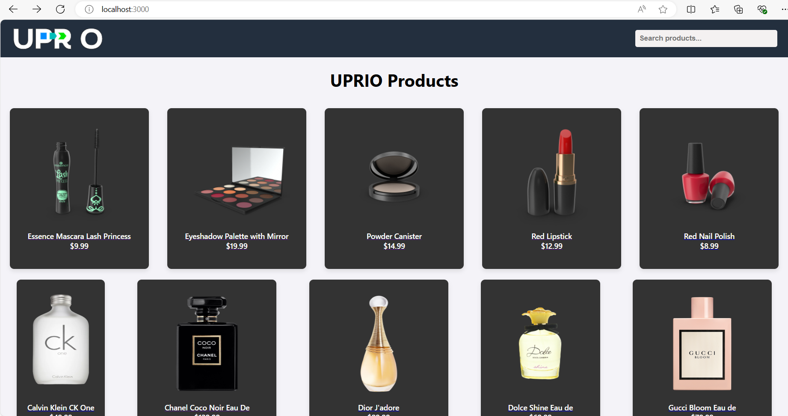
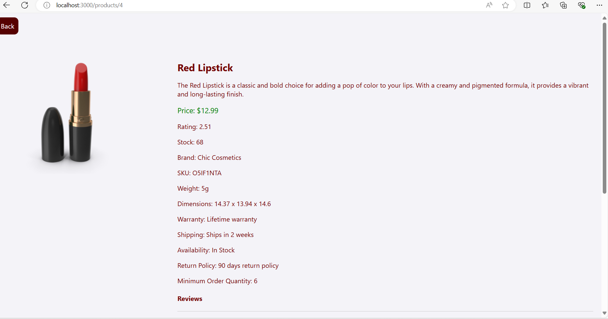

# Product Catalog Viewer

This is a small-scale React application that allows users to browse a list of products, view detailed information, and search for specific products. It uses the [DummyJSON](https://dummyjson.com/docs/products) API for product data.

## Features

1. **Products List (Page 1):**
   - Display a paginated list of products with basic information such as product name, image, and price.
   - Implement pagination to navigate through the product list.

2. **Product Details (Page 2):**
   - Allow users to click on a product in the list to view additional details on a new page.

3. **Product Search (Page 3):**
   - Add a product search page for users to search for products by name.

## Technologies Used

- React
- React Router
- Fetch (for API requests)
- CSS (for styling)

## Getting Started

1. Clone the repository:

   ```bash
   git clone https://github.com/your-username/product-catalog-viewer.git
   ```

2. Install dependencies:

   ```bash
   cd product-catalog-viewer
   npm install
   ```

3. Run the development server:

   ```bash
   npm start
   ```

   Open [http://localhost:3000](http://localhost:3000) to view the app in your browser.

## API Usage

- The application uses the DummyJSON API to fetch product data.
- Refer to the [DummyJSON documentation](https://dummyjson.com/docs/products) for details on available endpoints and data format.

## Screenshots




